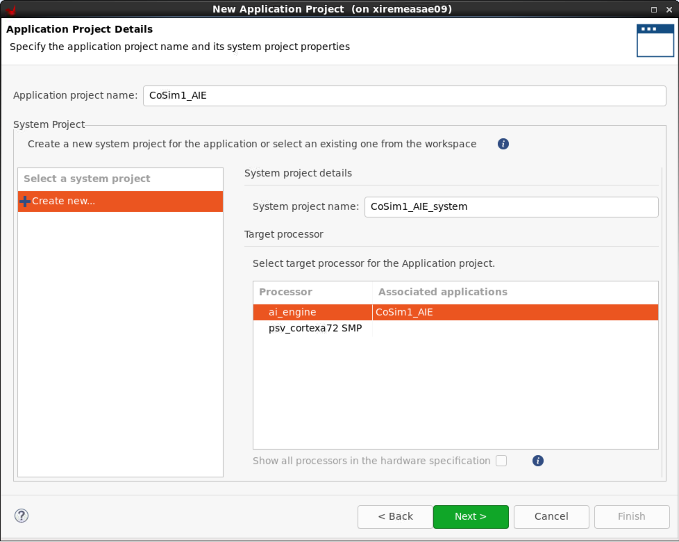
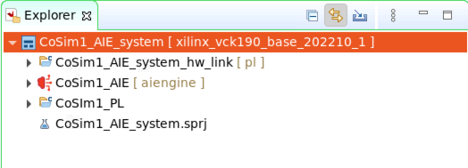
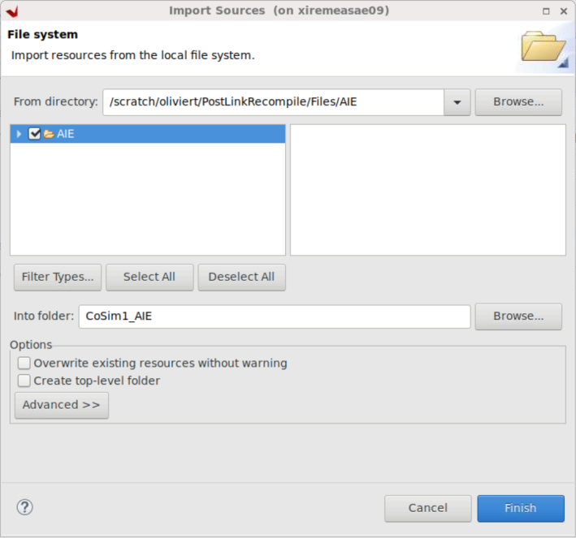
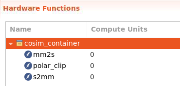
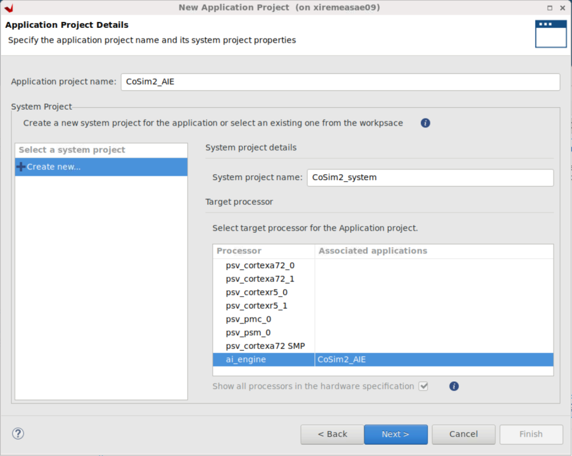
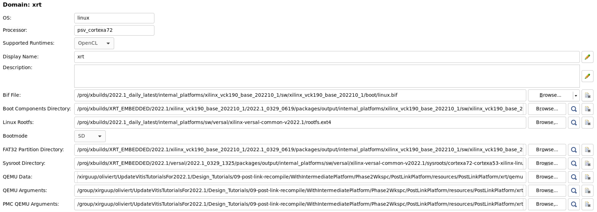

<table>
 <tr>
   <td align="center"><h1>Post-Link Recompile of an AI Engine Application</h1>
   </td>
 </tr>
 <tr>
 <td align="center"><h1>Vitis IDE Flow</h1>
 </td>
 </tr>

</table>


# Phase 1: Create a Fixed Platform from an AI Engine Application and PL Kernels

1. Launch the **Vitis IDE** on a new workspace, `Phase1Wkspc`:

   


2. The design that will be used for the purposes of this tutorial is shown in the following block diagram:

  

   The AI Engine graph itself is composed of two kernels:

   * **Interpolator**: which interpolates the input signal by 2.
   * **Classifier**: The output of this kernel is the quadrant of the input complex number.


   The Programmable Logic is composed of three kernels:

   * **mm2s**: sends data to the AI Engine through PLIO.
   * **PolarClip**: Clips the modulus of the data (complex data).
   * **s2mm**: gets data from the AI Engine through PLIO.

   Now create the project, starting with the AI Engine sub-project.

3. From the menu bar, select **File → New → Application Project**. In the platform selection GUI, select the **xilinx_vck190_base_202210_1 [custom]**. On the next screen, specify **CoSim1_AIE** as the Application Project Name and **CoSim1_system** as the System Project Name. Ensure that the selected Processor is **ai_engine**.

   

4. Select **Empty Application** in the template selection screen.

5. You must also include a hardware kernel project for the programmable logic part. Right-click **Cosim1_system** and select **Add Hw Kernel Project...**. Specify **CoSim1_PL** as the Hw Kernel Project Name.

You should now have the following project structure in the Explorer view:



6. Import the source code for the AI Engine sub-project. Right-click **CoSim1_AIE [aiengine]** and select **Import Sources...**. Browse to **Files** and select **AIE**. On the following screen, check **AIE** and remove the trailing **/src** from the "Into folder:" edit area.

   

7. Reiterate the same operations for the **CoSim1_PL** sub-project and selecting the directory **PL** in the Files directory.

   The `src` and `data` folders should be populated in the AI Engine sub-project, as well as the `src` folder in the programmable logic sub-project:

   

8. Set some parameters of the AI Engine sub-project. Right-click **CoSim1_AIE [aiengine]** and select **C/C++ Build Settings**. In the **Configuration** menu select _[ All Configurations ]_.

9. In the Top-Level Files sub-window, click **+**, then click **Workspace** and select **Cosim1_AIE/src/graph.cpp**.

   

   You can now compile the AI Engine project for Emulation-AIE active build configuration.

10. Right-click **CoSim1_AIE** and select **Build Project...**.

11. During compile, take a look in the file `graph.h` which contains the graph itself and the interface to the PL.

12. When the compilation has finished, you can visualize the result by double-clicking **Cosim1_system / CoSim1_AIE / Emulation-AIE / Compile Summary (graph)** in the Assistant view of the IDE. Vitis Analyzer is launched and you can visualize the graph and the array placement:

   

   The kernels are grouped in the 24th and 25th columns of the array. The communication with the the kernel `polar_clip`, as well as the input data and the output data transfers, also occur in columns 24 and 25 of the array.

13. Open the project file **Cosim1_PL/Cosim1_PL.prj**. Click the lightning icon to select all the PL kernels:

   

14. Select **mm2s**, **polar_clip**, and **s2mm**, then click **OK**.

15. Compile the PL kernels by right-clicking on **Cosim1_PL** and selecting **Build Project**.

   When the compilation is finished, link the AI Engine domain with the programmable logic domain. This can be done in the sub-project, `Cosim1_system_hw_link`, that was automatically created at the beginning of this tutorial. You have to define how you want the various parts of the design to be connected together. This is the purpose of the configuration file that you will now import.

16. Right-click **Cosim1_system_hw_link** and select **Import Sources...**. Browse to **PostLinkRecompile / Files / HwLink** and click **Open**. Check **system.cfg**. For the "Into folder:" edit area, click **Browse** and select **Cosim1_system_hw_link [pl]**.

17. In Explorer view, click **Cosim1_system_hw_link [pl] / Cosim1_system_hw_link.prj** to open the project file. There is one container named `binary_container_1`, populated with the three kernels `polar_clip`, `mm2s` and `s2mm`.

18. Click **binary_container_1** to change the name to **cosim_container**. Right-click **cosim_container** and select **Edit v++ options**. Specify the Vitis command line options: **--config ../system.cfg**. Specify **0** compute units for all these PL kernels as the number and the names are specified in the `system.cfg` file.



19. Right-click **Cosim1_system_hw_link [pl]** and select **Build Project**.

   The outcome of this link stage contains a major file `cosim_container.xsa` which isthe hardware platform specification

   

20. Double-click **cosim_container.xsa** to display the hardware platform specification. This is the address map for all IPs in the hardware platform.

21. Double-click **cosim_container.xsa.link_summary** to launch Vitis Analyzer. From here, you can visualize the system and platform diagram.


# Phase 2: Use a Platform generated by V++ and modify the AI Engine Application

The purpose of phase 2 of this tutorial is to start from the generated hardware platform and modify the AI Engine application. To start the second phase, close the Vitis software and then start it again using another workspace, **Phase2Wkspc**.

1. Create a new application project by clicking **File → New → Application Project**. In the Platform Selection screen, click **Create a new platform from hardware (XSA)**. To find the XSA file, browse to the XSA file that you generated in the previous stage: **CoSim1_system_hw_link / Emulation-HW / cosim_container.xsa**. Give it a new name: **PostLinkPlatform**.


2. Click **Next** to go back to the application project creation:

   * Application project name: **Cosim2_AIE**
   * System project name: **Cosim2_system**
   * Processor: **aiengine**



   In the Explorer view, you can see two projects have been created:

   * **CoSim2_system** with the sub-project **Cosim2_AIE**
   * **PostLinkPlatform**

3. Update the AI Engine project. Import the source files in the directory `AIE2`. Right-click **Cosim2_AIE** and select **Import Sources...**. Browse to **PostLinkRecompile / Files / AIE2**. On the next screen check **AIE2** and remove the trailing **/src** from the "Into folder:" edit area. There is a single modification in the file `graph.h`:

   * The interpolator kernel is now constrained to be placed in the AI Engine tile column 5 row 5.


4. Right-click **Cosim2_system → Cosim2_AIE** and select **C/C++ Build Settings**. In the Top-Level Files window, click **+**, click **Workspace**, and select **Cosim2_AIE / src / graph.cpp**. Click **Apply and Close**.

You can now build the AI Engine project. It will start by compiling the standalone domain of the PostLinkPlatform platform and continue with the AI Engine project.

5. After the compilation is finished, double-click **Cosim2_system / Cosim2_AIE / Emulation-AIE / Work / graph.aiecompile_summary**. Vitis Analyzer is launched. Display the **Graph** and the **Array**:

   

   On the left of the array view, you can see the effect of the constraint on the placement of the kernel `interpolator`. On the right, you can see the constraint implied by the platform itself.


   The kernel `interpolator` has been constrained to be placed in the tile (5,5).  In the previous phase, you saw that all the connections with the PL occurred within column 24 and 25. In this phase, these connections' locations have been turned into a constraint. This is why you see long routes to connect the predefined PLIOs with the new location of the `interpolator` kernel.

   The ultimate goal of this phase is the hardware emulation of the global system (AI Engine array, PL, PS). The Xilinx Runtime library (XRT) is a key component of the Vitis software platform that enables developers to deploy on Xilinx adaptable platforms, especially Versal ACAPs. The PS application in this tutorial is based on XRT.

6. Start by creating an XRT domain. Double-click **PostLinkPlatform / platform.spr**. In the PostLinkPlatform project GUI, right-click **PostLinkPlatform** and select **Add Domain**. Enter the following parameters:

| Option | Value |
| :--- | :--- |
| Name   | xrt  |
| OS   | linux  |
| Bif File   |  /**Your_Local_Install**/platforms/xilinx_vck190_base_202210_1/sw/xilinx_vck190_base_202210_1/boot/linux.bif |
| Boot Components Directory  |  /**Your_Local_Install**/platforms/xilinx_vck190_base_202210_1/sw/xilinx_vck190_base_202210_1/boot |
|Linux Image Directory   |  /**Your_Local_Install**/platforms/xilinx_vck190_base_202210_1/sw/xilinx_vck190_base_202210_1/xrt/image |


7. The XRT domain parameters are filled up automatically, but the Linux RootFS, sysroot directory, and all the QEMU parameters still need to be updated if they are not correctly specified:

| Option | Value |
| :--- | :--- |
| Linux Rootfs   |  /**Your_Local_Install**/common/xilinx-versal-common-v2022.1/rootfs.ext4 |
| Sysroot Directory   |  /**Your_Local_Install**/petalinux/2022.1/sysroots/cortexa72-cortexa53-xilinx-linux |
| QEMU Data   |  /**Your_Local_Install**/platforms/xilinx_vck190_base_202210_1/sw/xilinx_vck190_base_202210_1/qemu |
| QEMU Arguments   | /**Your_Local_Install**/platforms/xilinx_vck190_base_202210_1/sw/xilinx_vck190_base_202210_1/qemu/qemu_args.txt  |
| PMC QEMU Arguments   | /**Your_Local_Install**/platforms/xilinx_vck190_base_202210_1/sw/xilinx_vck190_base_202210_1/qemu/pmc_args.txt  |



8. In Explorer view, right-click **PostLinkPlatform** and select **Build project**.

9. Create a new application. Right-click **CoSim2_system** and select **Add Application project...**. Provide the application project name: **Cosim2_PS**. By default, it is associated to the processor `psv_cortexa72_SMP`, which contains the `xrt` domain. On the next screen, specify the kernel image.

| Option | Value |
| :--- | :--- |
| Kernel Image   |  /**Your_Local_Install**/common/xilinx-versal-common-v2022.1/Image |

10. Select the **Empty Application** template to finish the application project creation. After this step, there is nothing required other than the standard operations to perform hardware emulation.

11. Import the sources. Right-click **CoSim2_PS** and select **Import Sources**. Navigate to **PostLinkrecompile / Files / PS**. Check **PS**, remove the trailing **/src** in the "Into folder:" edit area, and click **Finish**.

12. There is another file to import, which has been automatically generated by the AI Engine compiler: `Cosim2_AIE/Emulation-AIE/Work/ps/c_rts/aie_control_xrt.cc`. It contains basic definitions related to the graph that are required during hardware emulation and hardware implementation. Copy it over to the directory `Cosim2_PS/src`.

13. Right-click **Cosim2_PS** and select **C/C++ Settings**.

14. In GCC Host Compiler(...), select **Dialect**. For the language standard, select **ISO C++ly(-stdc++1y)**.

15. In Includes, two paths need to be added:

   * `${workspace_loc:/Cosim2_AIE/src}`
   * `${env_var:XILINX_VITIS}/aietools/include`

16. Finally, in the GCC Host Linker (...), select **Libraries**. In the library search path, add the following two paths:

   * `${env_var:XILINX_VITIS}/aietools/lib/aarch64.o`
   * `${env_var:XILINX_VITIS}/aietools/lib/lnx64.o`

17. In Libraries, add the following two libraries:

   * `adf_api_xrt`
   * `xrt_coreutil`

18. Click **Apply and Close** to finish the settings. Build the PS application **CoSim2_PS**.

19. Open the **Cosim2_system** project file and fill in the packaging option: `../../../Phase1Wkspc/CoSim1_AIE_system_hw_link/Emulation-HW/cosim_container.xsa`. Build the system project **CoSim2_system**.


20. Run the `hw_emu` simulation. Right-click **CoSim2_system** and select **Run As → Run Configurations**. Double-click **System Project Debug** to create a new run configuration. Click the **Edit...** button beside the Program Arguments. The argument is the name of the XSA file: **cosim_container.xsa**. Uncheck the **Automatically add binary container(s) to arguments** option at the bottom of the window.

21. Click **Apply** and **Run**, then click **Start Emulator and Run**. The simulation runs to the end, specifying at `(Step 8)` (~2 minutes) that the simulation has passed.

# Hardware Implementation

1. Replicate exactly the same flow for hardware implementation, changing the system target to **Hardware** to run the design on your VCK190 board. Select one of the following base platforms depending on your board:

- `xilinx_vck190_base_202210_1`
- `xilinx_vck190_es1_base_202210_1`

2. When the two phases are completed, there will be a `sd_card.img` file in the `Hardware` directory. Use a standard SD card imager with this file to initialize an SD card.

3. Place the SD card in the top SD card slot of your board.

4. Open a serial terminal connected to the right COM port of your VCK190 and switch on your board.

5. The system boots. When this is finished, change the directory before launching the PS application.

```
cd /run/media/mmcblk0p1
./CoSim2.exe cosim_container.xsa
```


---

&copy; Copyright 2021 Xilinx, Inc.

Licensed under the Apache License, Version 2.0 (the "License");
you may not use this file except in compliance with the License.
You may obtain a copy of the License at

```
    http://www.apache.org/licenses/LICENSE-2.0
```

Unless required by applicable law or agreed to in writing, software
distributed under the License is distributed on an "AS IS" BASIS
WITHOUT WARRANTIES OR CONDITIONS OF ANY KIND, either express or implied.
See the License for the specific language governing permissions and
limitations under the License.


<p align="center"><sup>Copyright&copy; 2021 Xilinx</sup><br><sup>XD039</sup></br></p>
